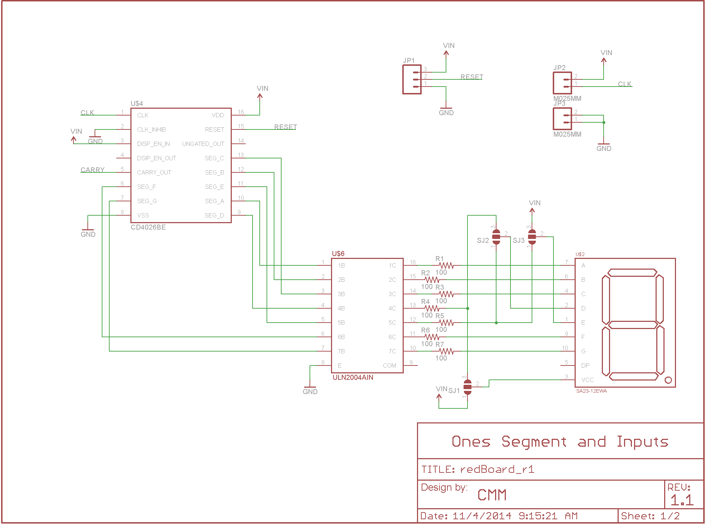
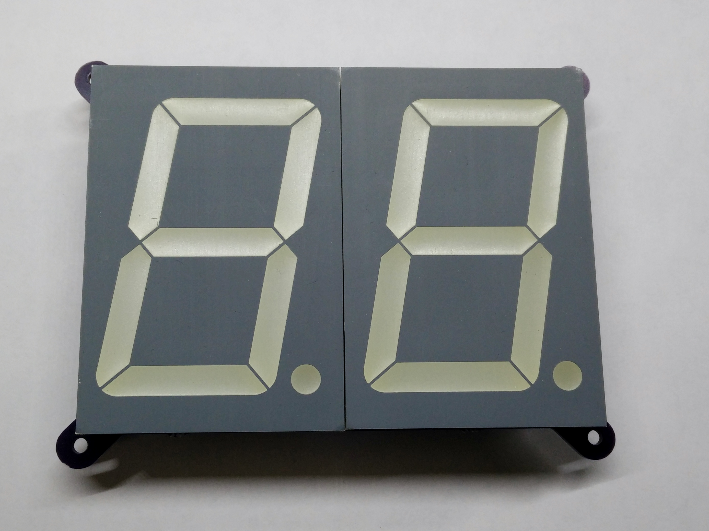
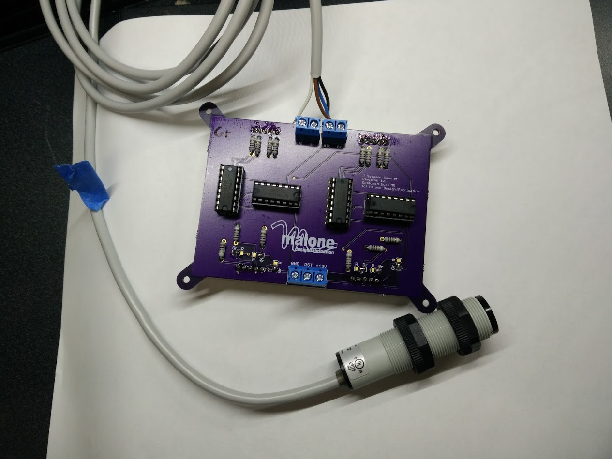

# Triggered Counter

Triggered Counter is a small device that count up whenever the input is pulsed. It uses two CD4026 decade counters to control two large 7-segment displays. This low cost counter board was originally designed as part of a prototype interactive exhibit at the Georgia Aquarium.

## Schematic

Each 7-segment section is controlled with identical hardware. The output of the sensor is fed directly to the clock input of the first CD4026. To protect the CD4026 from over current, the outputs of the CD4026 are fed into a ULN2004 Darlington pair array which is used to the control the LEDs of the 7-segment sections.

## PCB

The board was designed in EAGLE and fabricated by [Oshpark](http://oshpark.com).

